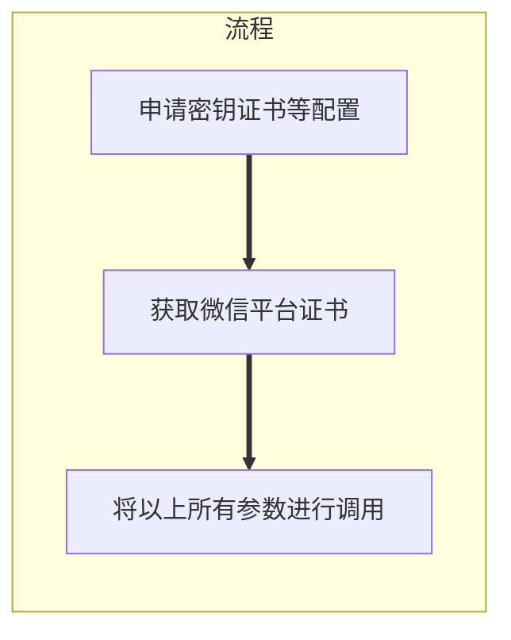

### 摘要
当需要使用微信支付时，需确保有一个可使用的appid，这里包括(微信公众平台、微信小程序、微信开放平台)等



### V3所需配置
- keyPath：apiclient_key.pem 商户 key 绝对路径
- certPath：capiclient_cert.pem 商户证书绝对路径
- certP12Path：apiclient_cert.p12 证书绝对路径（暂未使用、可忽略）
- platformCertPath：wx_cert.pem 微信平台证书绝对路径，证书需要通过接口获取
- mchId：微信支付商户号
- apiKey3：Api-V3密钥

### 微信商户证书申请流程

1. 登录商户平台
2. 账户中心
3. api安全
4. 生成证书

此步骤操作后可拿到(apiclient_key.pem、capiclient_cert.pem、apiclient_cert.p12)

### 微信平台证书(platformCertPath)获取步骤

使用[Certificate Downloader](https://github.com/wechatpay-apiv3/CertificateDownloader)进行生成

#### 所需配置
1. 商户的私钥文件(-f)：apiclient_key.pem路径
2. 证书解密的密钥(-k)：Api-V3密钥
3. 微信支付商户号(-m)：对应mchId
4. 微信证书输出路径(-o)
5. 商户证书序列号(-s)：申请商户证书后可查看序列号、或[点击此处查看](#微信支付查看证书序列号)

#### 操作步骤
1. 下载Certificate Downloader.jar文件
2. 执行完整命令
   
```shell
java -jar CertificateDownloader-1.1.jar -k ${apiV3key} -m ${mchId} -f ${mchPrivateKeyFilePath} -s ${mchSerialNo} -o ${outputFilePath}
```

### 微信支付查看证书序列号

证书打包解压路径内执行(微信支付v2  v3密钥必须32位，不然可保存，但使用会报签名错误)
```shell
openssl x509 -in apiclient_cert.pem -noout -serial
```